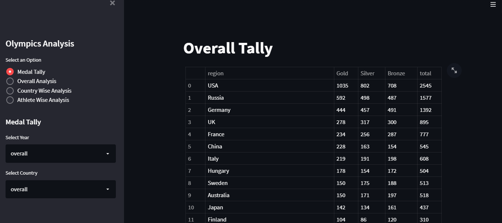
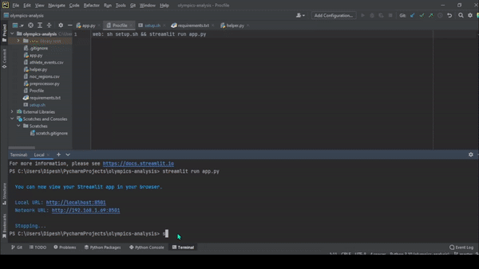

# Olympics Data Analysis Project

### App Screenshot



### Summary
Olympics Data Analysis Project, is done to find out how many sports are played till now from 1896 to 2016. Which country have participated how much time and which country have won which medal in which year and much more information. Basically, The reason for the development of this project is to learn data visualization. Aim of this project is to find out maximum details about olympics, players, award winning countries etc.


### Motivation

The main motivate to develop this project is to enhance my knowledge and to get internship in Data Science Position.


## Roadmap

- Taking Data

- Preprocessing Data

- Developing Data Visualization model to show data in graphs

- Developing Website for Movie Recommendation System

- Deploying the website in cloud ( heroku.com )


## Deployment

To deploy this project in local host follow following steps

```bash
  download the Zip File from my Github Profile
```
```bash
  Open any editor like VS Code or, pycharm
```
```bash
  Create new Project with virtual environment
```
```bash
  Copy downloaded files in your project
```
```bash
  Then install packages (in terminal type): pip install streamlit
```
```bash
   Install plotly packages (in terminal type): pip install plotly
```
```bash
   Install seaborn packages (in terminal type): pip install seaborn
```
```bash
   Install matplotlib packages (in terminal type): pip install matplotlib
```
```bash
  To run project (in terminal type) : streamlit run app.py 
```
## Tech Stack

**Client:** Machine Learning, Python, Statistics, Data Visualization

**Server:** Streamlit, heruko

## Dataset
Data set Link:  https://www.kaggle.com/datasets/heesoo37/120-years-of-olympic-history-athletes-and-results


## Demo

   


## App Live Demo 
Heroku App link: https://olympics-data-analy.herokuapp.com/

## Authors

- [@dipeshadhikarioffical](https://www.github.com/dipeshadhikarioffical)


## 🛠 Skills
Python, Machine Learning, Statistics, Excel, Data Analysis, SQL, Flask, Streamlit, Git


## 🔗 Follow Me On

[](https://www.linkedin.com/in/dipeshadhikarioffical/)
[](https://facebook.com/dipeshadhikarioffical)


